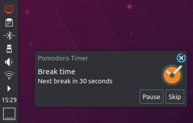

# asyncio-pomodoro

A simple asyncio ([qasync](https://github.com/CabbageDevelopment/qasync)) / pyside-based pomodoro timer for Linux desktops

## Description

This is a basic pomodoro timer for KDE or GNOME. It displays a tray icon on your X11 desktop and assists in timing and scheduling your breaks using the pomodoro technique.

It includes the following functionalities:

### Customizable break/activity windows

Allows specification of break intervals and the length of break periods.

### Notifications

Displays notifications using libnotify before break start/end. Optionally allows skipping a break.

### Enforcement

Can optionally trigger the desktop's lock screen on break begin.

### Feedback

Custom audio feedback is possible - allows selection of a custom audio file to play. The tray icon changes color based on the elapsed time.

### Other

* XDG-compatible configuration
* IPC control through UNIX signals (SIGUSR1 will pause/resume the timer, SIGUSR2 will reset)

## Rationale

This application was originally written as a demonstration for some reactive/asynchronous programming concepts using asyncio, but I also use it for the intended purpose, as it is mostly non-intrusive (leaving aside the optional screen-lock) and easily-controllable (just hit it with signals from any active terminal and it will behave as expected).

